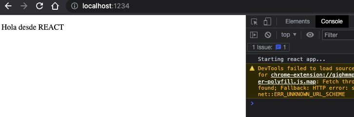

# Intro react

[REACT](https://es.reactTS.org/): creado por Facebook.

`REACT` es una libreria de frontend (o framework\* de frontend quizás) de pintado por pantalla, similar a DOM manipulation, pero sin necesidad de recargar la pantalla. React se puede ejecutar tanto en el cliente como en el servidor. Además, podemos usar React Native para crear aplicaciones nativas para Android e iOS.

Cuando trabajamos proyectos con interacción entre usuario y aplicación (DOM manipulation) es habitual encontrar funciones tipo `DocumentCreateElements` que genera todos los elementos por pantalla. No obstante, cada cambio implicaba una recarga completa de la pantalla del navegador.

Todo esto lo hará REACT de manera automática mediante `componentes`: entidad visual de nuestra aplicación (ej: una lista, imagen con texto, interface de usuario, etc). React se emplea precisamente para facilitar la `creación de componentes interactivos y reutilizables`. Cada uno de estos componentes posee su propio estado. Cuando dicho estado cambia, React lo vuelve a renderizar.

REACT trabaja mediante el `DOM en la sombra`. Se trata de una herramienta que consensua el DOM del navegador y su propio DOM.

> `DOM en la sombra`: Se puede pensar en el Shadow DOM como un DOM dentro del DOM. Si el DOM creaba un árbol DOM global, el Shadow DOM crea un sub-árbol dentro del DOM regular. Y dentro del sub-árbol, los nodos HTML, el CSS y el TS son independientes, siendo esta su principal ventaja, ya que permite la encapsulación de pequeñas partes del documento.

> `Virtual DOM`: React usa un DOM virtual para renderizar los componentes. El DOM virtual es una representación en memoria del DOM real. Cuando el estado de un componente cambia, React vuelve a renderizar la interfaz. En lugar de modificar el DOM real, React modifica el DOM virtual y, a continuación, compara el DOM virtual con el DOM real. De esta forma, React sabe qué cambios se deben aplicar al DOM real.

Podemos usar REACT para pintar en el navegador (`react dom`) y en apps (`react native`). En este aspecto, la forma interna de trabajar de REACT al pintar los componentes sirve tanto para navegador como para móvil.

En resumen: REACT es una librería de frontend que sirve para visualizar y crear componentes interactivos y reutilizables.

## Diferencia entre Shadow DOM y Virtual DOM

El Shadow DOM es una API del navegador que nos permite crear un árbol de nodos DOM independiente dentro de un elemento del DOM. Esto nos permite crear componentes que no interfieran con el resto de la aplicación. Se usa especialmente con Web Components.

El Virtual DOM es una representación del DOM en memoria. Esta representación se crea cada vez que se produce un cambio en el DOM. Esto nos permite comparar el DOM actual con el DOM anterior y así determinar qué cambios se deben realizar en el DOM real. Lo usa React y otras bibliotecas para hacer el mínimo número de cambios en el DOM real.

## React DOM

React DOM es la librería que se encarga de renderizar los componentes de React para el navegador. Hay que tener en cuenta que React es una biblioteca que se puede usar en diferentes entornos (dispositivos móviles, apps de escritorio, terminal...).

Mientras que la biblioteca de React, a secas, es el motor de creación de componentes, hooks, sistema de props y estado... React DOM es la librería que se encarga de renderizar los componentes de React específicamente en el navegador.

React Native, por ejemplo, haría lo mismo, pero para dispositivos móviles.

## Set-up

Vamos a crear un primer proyecto en REACT que nos permita poner en práctica los conceptos iniciales. Para ello emplearemos [NODEJS](https://github.com/amargopastor-codealong/ca-nodejs).

[gitignore.io](https://www.toptal.com/developers/gitignore)

```bash
touch .gitignore
yarn init -y
yarn add eslint
yarn eslint --init
yarn add react react-dom typescript axios parcel
tsc --init
yarn add @types/react @types/react-dom @types/node
```

> package.json

```json
{
	// (...)
	"scripts": {
		"start": "parcel index.html"
	},
	"dependencies": {
		// (...)
	}
	// (...)
}
```

> .eslintrc.json

```json
{
	"env": {
		"browser": true,
		"es2021": true
	},
	"extends": ["plugin:react/recommended", "airbnb"],
	"parser": "@typescript-eslint/parser",
	"parserOptions": {
		"ecmaFeatures": {
			"jsx": true
		},
		"ecmaVersion": "latest",
		"sourceType": "module"
	},
	"plugins": ["react", "@typescript-eslint"],
	"rules": {
		"react/function-component-definition": "off",
		"react/jsx-filename-extension": "off",
		"camelcase": "off",
		"import/no-unresolved": "off",
		"import/extensions": "off"
	}
}
```

```bash
touch index.html
mkdir src
cd src
touch App.tsx index.tsx
```

> index.html

```html
<!DOCTYPE html>
<html lang="en">
	<head>
		<meta charset="UTF-8" />
		<meta name="viewport" content="width=device-width, initial-scale=1.0" />
		<title>React App</title>
	</head>

	<body>
		<div id="app-root"></div>
		<script type="module" src="./src/index.tsx"></script>
	</body>
</html>
```

> index.tsx

```tsx
import React from 'react';
import { createRoot } from 'react-dom/client';
import App from './App';

console.log('Starting react app...');

const appRoot = document.getElementById('app-root') as Element;
const root = createRoot(appRoot);

// Renderiza App (que es un componente) dentro del elemento appRoot. App es el COMPONENTE RAÍZ.
root.render(<App />);
```

> App.tsx

```tsx
import React from 'react';

// Nota: Esto es un componente "funcional". Se le llama funcional porque se usa una función en lugar de una clase
const App = () => <p>Hola desde REACT</p>;

export default App;
```

## Librería react-dom

Un `COMPONETE` es un elemento compuesto de HTML y TS (elemento con interactivdad). Es decir, encapsulamos en una misma entidad visual una cierta funcionalidad; por ejemplo, la barra de búsqueda de google es un componente con interactividad.

`Componente RAÍZ`: componente o entidad visual del que colgarán el resto de componente. Aquí montamos toda la aplicación (todos los componentes). Los componentes mantienen una estructura jerárquica.

## La nueva sintaxis TSX

REACT introduce una nueva sintaxis llamada `TSX (TS + HTML): etiquetas html dentro de TS`. TSX es una ampliación de la sintaxis de TS para soportar etiquetas html en sus documentos. Es una manera más corta para programar en REACT.

Para este proyecto comenzamos a trabajar `Parcel`: una herramienta que lee los archivos y convierte las etiquetas TSX en sintaxis TS real gracias al transpilador (un codigo fuente a otro codigo fuente). Parcel usa este elemento para convertir TSX a TS y, posteriormente, a JS.

Dentro de la carpeta dist que nos genera parcel podemos encontrar nuestros archivos JS compilados y ver como se han transpilado los distintos elementos de nuestra aplicación.

Por ejemplo, el siguiente código no es código válido de JS a menos que lo compilemos previamente (con `parcel` u otro compilador):

```TS
const App = () => <p>Hola</p>;
```

Cuando desarrollemos una aplicaicón completa con REACT veremos que existen distintas fases de compilación:

- Compilar TSX a TS
- Compilar TS al JS final

Parcel hace todo el proceso gracias a un programa interno llamado [`webpack`](https://webpack.js.org/): es dónde definimos el flujo de pluggins de conversión a JS y sus distintas versiones.

La implementación de webpack es compleja por eso empleamos parcel que trae ya todo configurado.

## Nuevo componente

```bash
cd src
mkdir components
touch Card.tsx
```

Editamos nuestro primer componente:

> Card.tsx

```tsx
import React from 'react';

const Card = () => <p>Card</p>;

export default Card;
```

Y lo incorporamos a la aplicación:

> App.tsx

```tsx
// (...)
import Card from './components/Card';

const App = () => (
	<div className="cardlist">
		<Card />
		<Card />
		<Card />
	</div>
);

// (...)
```

<p align="center">
  
</p>

> NOTA: Si a un `div` le queremos poner una etiqueta `class` en REACT empleamos `className`. La razón por la que se llama className es porque class es una palabra reservada en JavaScript. Por eso, en JSX, tenemos que usar className para aplicar clases CSS.

## REACT DEV TOOLS

Gracias a la extensión de CHROME [`REACT DEV TOOLS`](https://chrome.google.com/webstore/detail/react-developer-tools/fmkadmapgofadopljbjfkapdkoienihi?hl=es) podemos ver la gerarquía y los componentes (diferenciados unos de otros) generados y pintados.

De esta manera en lugar de una estructura clásica de DOM podemos ver cada componente y diferenciar los mismos (aunque un componente esté dentro de otro, esta herramienta los diferencia).

Vamosa detallar nuestro componente card:

> Card.tsx

```tsx
// (...)

const Card = () => (
	<div>
		
		<p>Developer Excuses</p>
	</div>
);

// (...)
```

## Styles

A la hora de añadir estilos tenemos que enfrentarnos al siguiente reto: el `CSS en REACT lo escribiremos como JS`. En REACT, los estilos en línea no funcionan como string, tienen una sintaxis especial llamada `CSS como OBJECTO`. La sintaxis correcta es creando un objeto ya que en REACT los estilos en línea tienen que ser un objeto, no un string:

> Card.tsx

```tsx
// (...)

const styleObject = {
	border: '1px solid red',
	padding: 10,
	marginTop: 10,
	marginLeft: '5px',
	marginRight: 5,
	margin: '10px 5px 0 5px',
	display: 'inline-block',
	textAlign: 'center' as 'center',
};

const Card = () => {
	const image =
		'https://preview.redd.it/0q9k35rs52461.jpg?width=1920&format=pjpg&auto=webp&s=28a96947814b6207c596c34b4e623bc6c9683692';
	const title = 'Developer Excuses';
	return (
		<div style={styleObject}>
			
			<p>{title}</p>
		</div>
	);
};

// (...)
```

> ATENCIÓN: Convención de REACT llama al CSS como OBJ (común para REACT, ANGULAR, REACT NATIVE...). En JS las propiedades no pueden tener guiones en su nombre por lo que no podemos declarar `margin-top:10` sino emplear `marginTop: 10`.

Si ya estamos insertando variables podemos optimizar el proceso con objetos de información:

```bash
mkdir data
touch excuses.tsx
```

> excuses.ts

```tsx
interface iExcuses {
	[index: string]: { title: string; image: string };
}

const list: iExcuses = {
	one: {
		title: 'I haven’t touched that module in weeks!',
		image:
			'https://preview.redd.it/0q9k35rs52461.jpg?width=1920&format=pjpg&auto=webp&s=28a96947814b6207c596c34b4e623bc6c9683692',
	},
	two: {
		title: 'It must be a hardware problem.',
		image:
			'https://preview.redd.it/0q9k35rs52461.jpg?width=1920&format=pjpg&auto=webp&s=28a96947814b6207c596c34b4e623bc6c9683692',
	},
	three: {
		title: 'Somebody must have changed my code.',
		image:
			'https://preview.redd.it/0q9k35rs52461.jpg?width=1920&format=pjpg&auto=webp&s=28a96947814b6207c596c34b4e623bc6c9683692',
	},
};

export default list;
```

> Card.tsx

```tsx
import React from 'react';
import list from '../../data/excuses';

const styleObject = {
	// (...)
};

export const Card = () => {
	const { title, image } = list.one;
	return (
		<div style={styleObject}>
			
			<p>{title}</p>
		</div>
	);
};
```

## PROPS

Al igual que las etiquetas tienen atributos, los componentes en `REACT tienen propiedades o PROPS`. De modo que los atributos se convierten en un objeto (datos) que contiene información y nos permite trabajar, compartir información entre componentes, etc.

> Card.tsx

```tsx
// (...)

const styleObject = {
	// (...)
};

const Card = (props: any) => {
	console.log('Excuse props', props);
	const { title, image } = list.one;
	return (
		<div style={styleObject}>
			
			<p>{title}</p>
		</div>
	);
};

// (...)
```

Al hacer `console.log('Excuse props', props);` se muestran por consola 3 console props (por cada componente se ejecuta la función una vez). El mismo componente se está reutilizando y pintando 3 veces. Esta es una de las ventajas de REACT: la reutilización de componentes.

Las `props son un objeto vacío` que podemos emplear en nuestro favor. En la terminal vemos que cada componente recibe su objeto props (tiene un objeto con la etiqueta y valor indicados).

Lo que cada componente tiene como atributo en `App.tsx` se convierte en un objeto (con sus repectivos atributos) en el componente `Card.tsx`.

> App.tsx

```js
// (...)

const App = () => (
	<div className="cardlist">
		<Card ex="one" />
		<Card ex="two" />
		<Card ex="three" />
	</div>
);

// (...)
```

En REACT se suele escribir de la siguiente manera, sacando solo las props que nos interesan:

> Card.tsx

```js
// (...)

const Card = (props: { ex: string }) => {
	console.log('Excuse props', props);
	const { ex } = props;
	const { title, image } = list[ex];
	return (
		<div style={styleObject}>
			
			<p>{title}</p>
		</div>
	);
};

// (...)
```

## Explorando las props

Los componentes reciben props y devuelven la representación visual del componente. Podemos convertir `styleObject` en una función que recibe un parámetro `colorBorder` y que la emple en los estilos:

> App.tsx

```tsx
export const App = () => {
	return (
		<div className="cardlist">
			<Card ex="one" color="red" />
			<Card ex="two" color="green" />
			<Card ex="three" color="yellow" />
		</div>
	);
};
```

> Card.tsx

```tsx
// (...)

const styleObject = (color: string) => ({
	border: `1px solid ${color}`,
	padding: 10,
	marginTop: 10,
	marginLeft: '5px',
	marginRight: 5,
	display: 'inline-block',
	textAlign: 'center' as 'center',
});

const Card = (props: { ex: string; color: string }) => {
	console.log('Excuse props', props);
	const { ex, color } = props;
	const { title, image } = list[ex];
	return (
		<div style={styleObject(color)}>
			
			<p>{title}</p>
		</div>
	);
};

// (...)
```

Es decir, los propios estilos visuales se pueden parametrizar y escribir con poco código muchas cosas.

En resumen, un componente funcional recibe unas props y devuelve la representación visual de ese componente (que a su vez puede delegar la represnetación visual de otros componentes en los mismos).

## Renderizado de listas

El renderizado de listas es la forma de iterar un array de elementos y renderizar elementos de React para cada uno de ellos.

Para REACT cada elemento es único, lo que le permite eliminar SÓLO el componente deseado identificándolo mediante una key. En esencia, esto permite la reconciliación con el DOM.

REACT está programado de tal manera que identifica mediante una key (un id, el iterador de map, etc) cada elemento de la lista y borra solo el indicado, haciendo que el performance en REACT sea muy rápido.

> App.tsx

```tsx
import React from 'react';
import list from '../data/excuses';
import Card from './components/Card';

const App = () => {
	const excusesKeys = Object.keys(list);
	onsole.log(excusesKeys);
	return (
		<div className="cardlist">
			{excusesKeys.map((ex, i) => (
				// eslint-disable-next-line react/no-array-index-key
				<Card key={i} ex={list[ex]} color="red" />
			))}
		</div>
	);
};

export default App;
```

> Card.tsx

```tsx
import React from 'react';

const styleObject = (color: string) => ({
	border: `1px solid ${color}`,
	padding: 10,
	marginTop: 10,
	marginLeft: '5px',
	marginRight: 5,
	display: 'inline-block',
	textAlign: 'center' as 'center',
});

const Card = (props: {
	ex: { title: string; image: string };
	color: string;
}) => {
	const { ex, color = 'red' } = props;
	console.log(ex);
	const { title, image } = ex;
	return (
		<div style={styleObject(color)}>
			
			<p>{title}</p>
		</div>
	);
};

export default Card;
```

## Hooks

Los Hooks son una API de React que nos permite tener el estado, y otras características de React, de los componentes creados con una function. Hooks es gancho y, precisamente, lo que hacen, es que te permiten enganchar tus componentes funcionales a todas las características que ofrece React.

Vamos a añadir un btn en cada card que ejecute una función `excuseHandler`:

> Card.tsx

```tsx
// (...)

const Card = (props: {
	ex: { title: string; image: string };
	color: string;
}) => {
	const { ex, color = 'red' } = props;
	const { title, image } = ex;
	const excuseHandler = () => {
		console.log(`Click on excuse: ${title}`);
	};
	return (
		<div style={styleObject(color)}>
			
			<p>{title}</p>
			<button type="button" onClick={excuseHandler}>
				Select
			</button>
		</div>
	);
};

// (...)
```

Vamos a hacer que el color cambie con el hook useState(). Un hook es una función que nos permite alterar un componente.

`useState()`: Es un hook que importamos de REACT y empleamos para crear variables de estado (valor dinámico) que pueden variar en el tiempo y requieran una re-renderización del componente. Es decir, permite hacer que un componente se renderice de nuevo. Por norma se refiere a un estado visual (que condiciona el pintado visual de un componente).

El hook useState tiene la siguiente forma: siempre recibe un array donde el primer elemento del mismo es el value y el segundo elemento es una función que modifica dicho valor (setValue):

```ts
const [value, setValue] = useState();
```

> IMPORTANTE: React solo re-pinta un componente en dos casos:
>
> 1. Si cambia una prop
> 2. Si cambia el estado de un componente (useState).

> Un hook es como un enganche: este componente está enganchado a un estado.

## Estableciendo useState() con isActive

Nuestro nuevo hook useState inicia su valor a false. Cuando ejecutamos la función `excuseHandler` la variable de estado isActive modificará su valor gracias a setIsActive:

> Card.tsx

```tsx
import React, { useState } from 'react';

const styleObject = (isActive: boolean) => ({
	border: `1px solid ${isActive ? 'green' : 'red'}`,
	padding: 10,
	marginTop: 10,
	marginLeft: '5px',
	marginRight: 5,
	display: 'inline-block',
	textAlign: 'center' as 'center',
});

const Card = (props: { ex: { title: string; image: string } }) => {
	const { ex } = props;
	const { title, image } = ex;

	const [isActive, setIsActive] = useState(false);

	const excuseHandler = () => {
		console.log(`Click on excuse: ${title}`);
		setIsActive(!isActive);
	};
	return (
		<div style={styleObject(isActive)}>
			
			<p>{title}</p>
			<button type="button" onClick={excuseHandler}>
				Select
			</button>
			<p>status: {isActive ? 'true' : 'false'}</p>
			{isActive && <p>Excuse already used</p>}
			{!isActive && <p>excuse available</p>}
		</div>
	);
};

export default Card;
```

## UseEffect

El `hook useEfect` controla cuándo ejecutar el efecto colateral de algo. Posee dependencias que indican cuándo ejecutar el efecto. Se usa para ejecutar código cuando se renderiza el componente o cuando cambian las dependencias del efecto.

Vamos a instalar axios y crear una función que consuma información de una API externa.

> lib/getExcuse.ts

```ts
import axios from 'axios';

const getExcuse = async () => {
	const res = await axios.get('http://localhost:3001/excuses/random');
	const { title } = res.data;
	const wrapdata = {
		title,
	};
	console.log(wrapdata);
	return wrapdata;
};

export default getExcuse;
```

> ExcusefromApi.tsx

```tsx
import React from 'react';
import getExcuse from '../../lib/getExcuses';

const ExcusefromApi = () => {
	const ex = getExcuse();
	console.log(ex);
	return <p>ExcuseApi</p>;
};

export default ExcusefromApi;
```

> App.tsx

```tsx
import React from 'react';
import list from '../data/excuses';
import ExcusefromApi from './components/ExcusefromApi';
import Card from './components/Card';

const App = () => {
	const excusesKeys = Object.keys(list);
	return (
		<div className="cardlist">
			<ExcusefromApi />
			{excusesKeys.map((ex, i) => (
				// eslint-disable-next-line react/no-array-index-key
				<Card key={i} ex={list[ex]} />
			))}
		</div>
	);
};

export default App;
```

Obtenemos nueva información gracias a ExcusefromApi. No obstante, si quisiérmaos trabajar la información de la siguiente manera nos encontramos con que por consola obtenemos una promesa.

Al ser JS asíncrono, necesitamos esperar de alguna manera a que la promesa se resuelva antes incluso de iniciar el pintado. Podríamos tratar de emplear `async` pero obtenemos un error desde REACT:

> ExcusefromApi.tsx

```tsx
// (...)

const ExcusefromApi = async () => {
	const ex = await getExcuse();
	console.log(ex);
	return <p>ExcuseApi</p>;
}; // --> Uncaught Error: Objects are not valid as a React child
```

Estamos viendo como esta función devuelve una promesa y de que manera REACT no puede renderizar componentes que dependan de esta asincronía. Dicho de otra manera, cuando REACT va a pintar un componente necesita decidir que HTML va a insertar en el momento: no puede esperar a la futura resolución.Es en este punto cuando recurrimos a useEffect.

`HOOK useEfect`: controla cuándo ejecutar el efecto colateral de algo gracias a sus dependencias.

> App.tsx

```tsx
import React from 'react';
import ExcusefromApi from './components/ExcusefromApi';

const App = () => (
	<div className="cardlist">
		<ExcusefromApi />
		<ExcusefromApi />
		<ExcusefromApi />
	</div>
);

export default App;
```

> getExcuse.tsx

```tsx
import axios from 'axios';

const getExcuse = async () => {
	const res = await axios.get('http://localhost:3001/excuses/random');
	const { title } = res.data;
	return title;
};

export default getExcuse;
```

> ExcusefromApi.tsx

```tsx
import React, { useState, useEffect } from 'react';
import getExcuse from '../lib/getExcuse';
import Card from '../components/Card';

// Cuando se monte el componente en el DOM por primera vez llama a esta función.
// [] -> dependencias: indian cuando ejecutar un efecto
// En este caso, al estar vacío el array de dependencias,
// este efecto se ejecuta solo cuando el componente
// se monta por primera vez en el DOM

const ExcusefromApi = () => {
	const [excuse, setExcuse] = useState();
	useEffect(() => {
		getExcuse().then((ex) => {
			setExcuse(ex);
		});
	}, []);

	if (excuse) {
		return (
			<div>
				<Card excuse={excuse} />
			</div>
		);
	}
	return <p>loading excuse...</p>;
};

export default ExcusefromApi;
```

> Card.tsx

```tsx
import React, { useState } from 'react';

const styleObject = (isActive: boolean) => ({
	// (...)
});

const Card = (props: { ex: string }) => {
	const { ex } = props;
	const image =
		'https://preview.redd.it/0q9k35rs52461.jpg?width=1920&format=pjpg&auto=webp&s=28a96947814b6207c596c34b4e623bc6c9683692';

	const [isActive, setIsActive] = useState(false);

	const excuseHandler = () => {
		setIsActive(!isActive);
	};
	return (
		<div style={styleObject(isActive)}>
			
			<p>{ex}</p>
			<button type="button" onClick={excuseHandler}>
				Select
			</button>
			<p>status: {isActive ? 'true' : 'false'}</p>
			{isActive && <p>Excuse already used</p>}
			{!isActive && <p>excuse available</p>}
		</div>
	);
};

export default Card;
```
